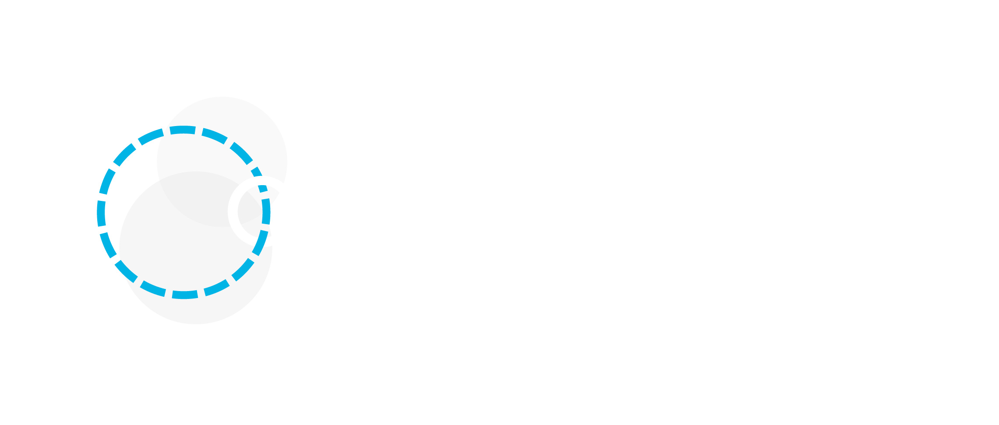

# OppyDev

<div align="center">



OppyDev is a new agent based AI assisted coding tool focused on AI and human collaboration. It’s been built to streamline the back and forth process between the developer and AI, allowing you to code faster without losing sight of how things work. This repository hosts open source plugins and documentation for OppyDev. You can also use the issues section [here](https://github.com/OppyDevAI/OppyDev/issues) to report bugs and request new features.

<h3>

[Homepage](https://oppydev.ai/) | [Documentation](https://oppydev.ai/documentation) | [Download](https://oppydev.ai/download) | [Getting Started](https://oppydev.ai/documentation)

</h3>

</div>
<div align="left">

Run this command in your terminal to create an oppydev folder with the contents of this repo.

```sh
wget https://github.com/OppyDevAI/OppyDev/archive/refs/heads/main.zip -O OppyDev-main.zip && unzip OppyDev-main.zip && mv OppyDev-main oppydev && rm OppyDev-main.zip
```

After running the command, you will have a directory named `oppydev` containing the OppyDev project files. This will contain all the documentation you need to get started writing plugins as well as several example plugins.

</div>